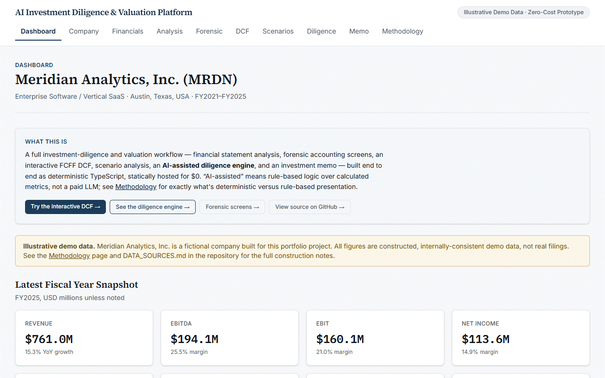
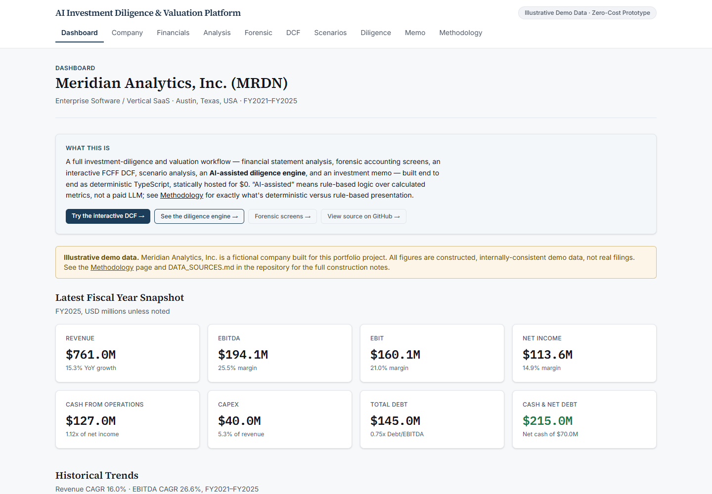
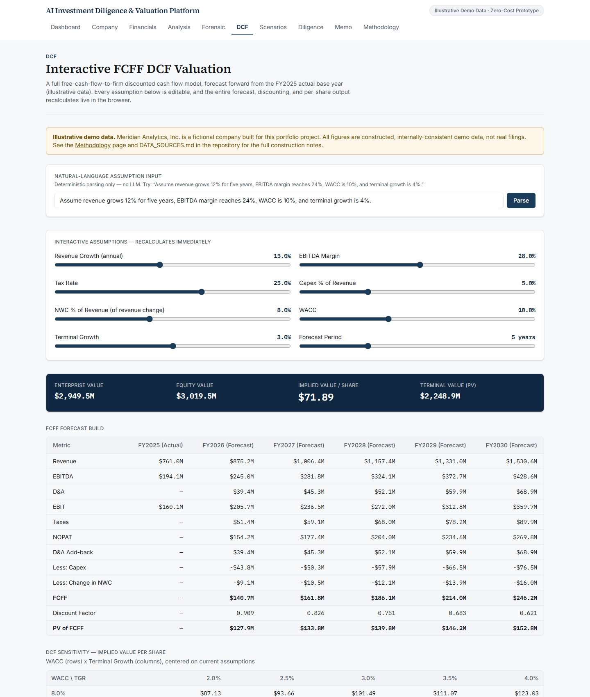
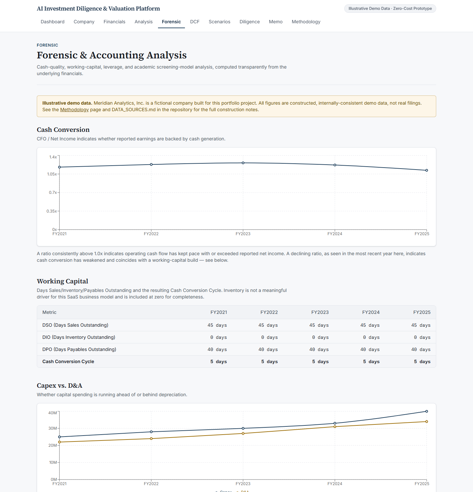
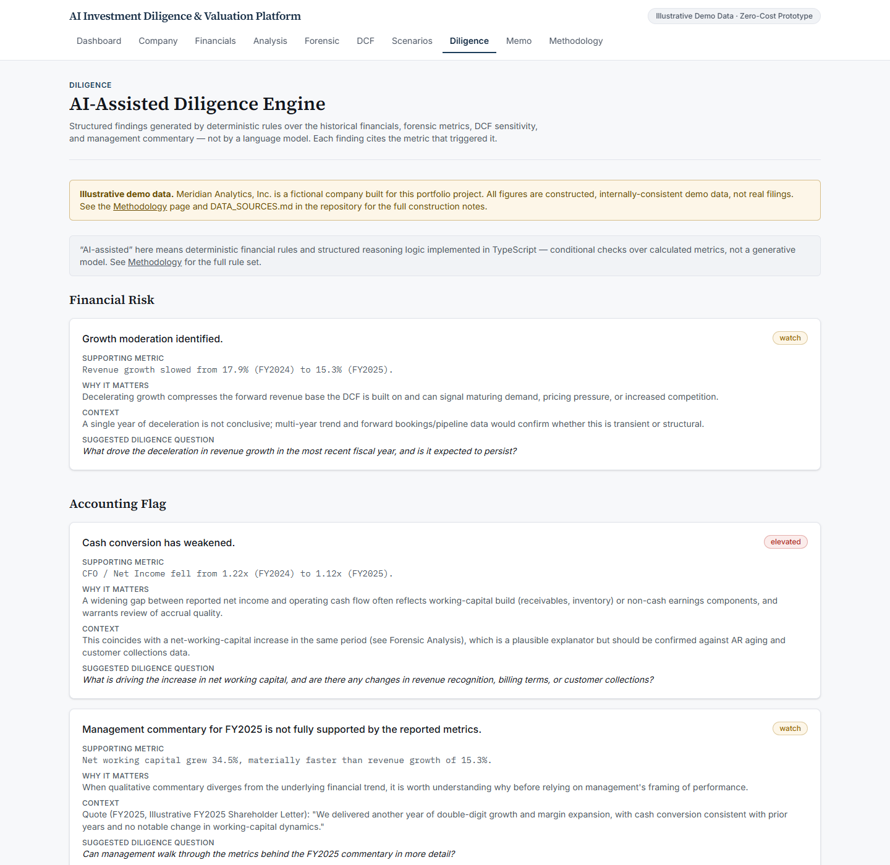
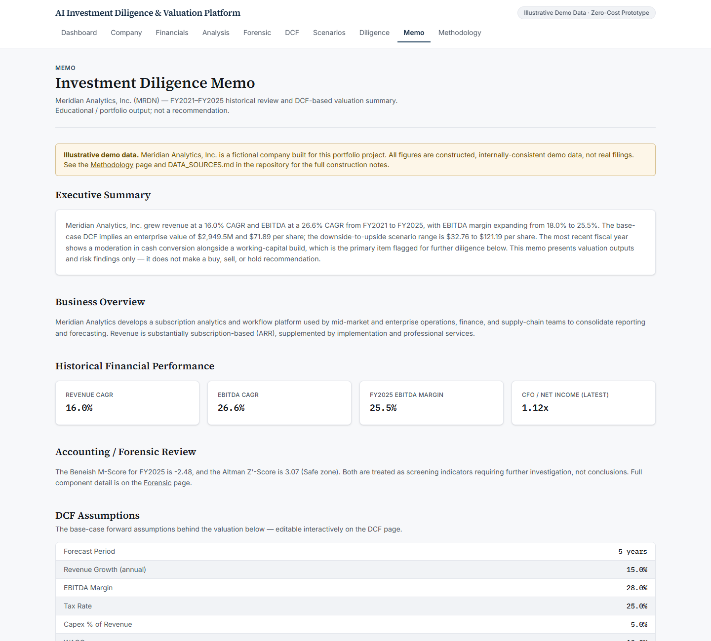
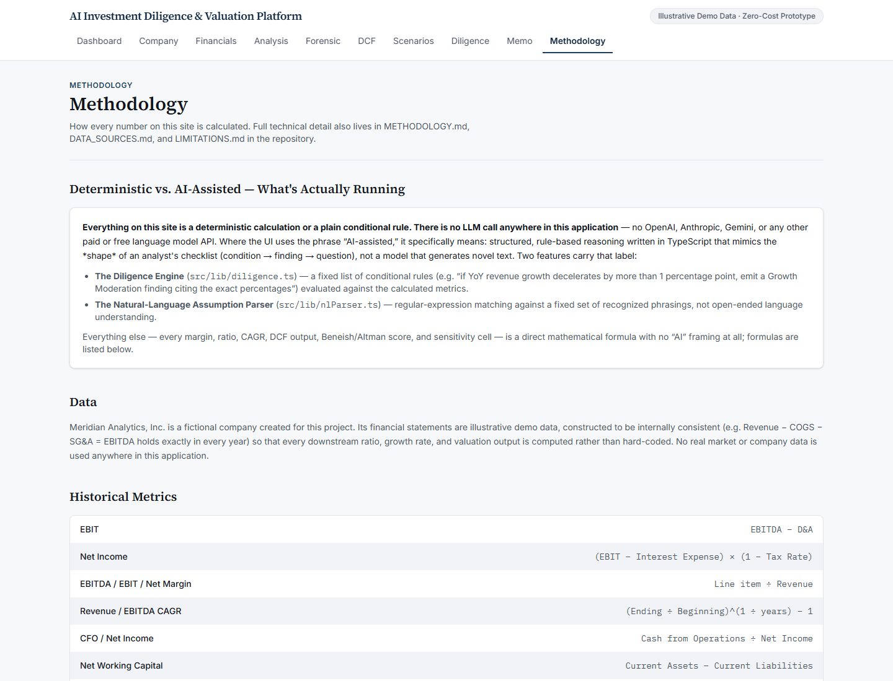

# AI Investment Diligence & Valuation Platform

An interactive, zero-cost investment diligence and DCF valuation web app — financial statement analysis, forensic accounting screens, a live FCFF DCF, scenario analysis, a rule-based diligence engine, and an investment memo, all computed deterministically in the browser.

**Live Demo:** [aastha2806.github.io/ai-investment-diligence-platform](https://aastha2806.github.io/ai-investment-diligence-platform/)
**Repository:** [github.com/Aastha2806/ai-investment-diligence-platform](https://github.com/Aastha2806/ai-investment-diligence-platform)

### Demo

A real walkthrough of the live site — Dashboard → Financials → Forensic → DCF → Diligence → Memo (captured from the actual deployed app, not a mockup):



### Screenshots

**Dashboard**


**Interactive FCFF DCF**


**Forensic & Accounting Analysis**


**AI-Assisted Diligence Engine**


**Investment Memo**


**Methodology**


## What This Project Does

It walks a single illustrative company through a full diligence-and-valuation workflow — **Company → Financials → Historical Analysis → Forensic Analysis → DCF Valuation → Scenario Analysis → Diligence → Investment Memo** — with every margin, ratio, CAGR, DCF output, and forensic score computed live from raw line items, not hard-coded. It produces valuation ranges, scenario outputs, and diligence questions — **never a buy, sell, hold, or price-target recommendation.**

## Why It Was Built

As a portfolio project bridging finance and software engineering, for Investment Banking, Private Equity / Private Markets, Venture Capital, Hedge Fund / Buy-Side, and Equity Research applications — built with a hard zero-cost constraint (no paid APIs, no paid hosting, no database) so it can be shared and scaled to any amount of traffic without ever costing anything.

## Key Finance Capabilities

- **Historical analysis** — Revenue/EBITDA CAGR, margin trends, CFO/Net Income, leverage ratios, all derived from raw statement line items.
- **Working-capital analysis** — DSO, DIO, DPO, and the Cash Conversion Cycle.
- **Forensic accounting screens** — the 8-variable Beneish M-Score and the private-company Altman Z'-Score, both explicitly framed as *screening indicators requiring further investigation*, never as proof of fraud or distress.
- **FCFF DCF valuation** — a full forecast → NOPAT → FCFF → discounting → terminal value → enterprise/equity value → implied value-per-share build, interactively editable with live recalculation and a WACC × terminal-growth sensitivity grid.
- **Scenario analysis** — downside / base / upside cases through the identical DCF engine, with no scenario flagged as "correct."
- **Diligence engine** — deterministic rules that turn financial signals into cited findings and follow-up diligence questions.
- **Investment memo** — a compact, interview-ready summary with explicit assumptions, findings, open questions, and limitations — no recommendation.

## Key Technical Capabilities

- A pure, framework-free TypeScript calculation engine (`src/lib/`) — 65 automated unit tests, zero React/Next.js imports, fully independent of the UI.
- A fully interactive client-side DCF workbench (live sliders, live sensitivity table, a deterministic natural-language assumption parser).
- A statically exported Next.js App Router site with correct GitHub Pages subpath handling (`basePath`/`assetPrefix`) — verified to work under `/ai-investment-diligence-platform/`.
- CI (GitHub Actions) that runs the full test/lint/build pipeline before every deploy.

## Architecture Overview

```
Browser
  └── Static HTML/CSS/JS (from `next build` → /out)
        ├── Server-rendered pages (tables, static content)
        └── Client components ("use client") — DCF workbench, scenario switcher
              └── src/lib/* — pure, deterministic calculation functions
                    └── src/data/*.json — illustrative input data
```

Full module-by-module breakdown in [ARCHITECTURE.md](ARCHITECTURE.md).

## DCF Methodology

A standard Free Cash Flow to Firm (FCFF) build: forecast revenue/EBITDA/EBIT from flat assumption rates → NOPAT → add back D&A → subtract capex and the change in NWC → FCFF → discount at WACC → Gordon Growth terminal value → enterprise value → equity value (− debt + cash) → implied value per share. Every step is a plain formula in `src/lib/dcf.ts`, unit-tested line by line, with a WACC × terminal-growth sensitivity grid that reruns the identical function across a range of inputs. Full formulas in [METHODOLOGY.md](METHODOLOGY.md).

## Forensic Analysis

- **Beneish M-Score** (8-variable, 1999 model) — DSRI, GMI, AQI, SGI, DEPI, SGAI, TATA, LVGI, combined into a single screening score.
- **Altman Z'-Score** (private-company variant, book value of equity) — bankruptcy-risk screening, with an explicit note that it was calibrated on manufacturers.
- Both are labeled throughout the UI as **screening indicators requiring further investigation**, never as conclusions.
- A **management-commentary-vs-metrics checker** that flags when a qualitative claim (e.g. "margin expansion," "stable working capital") diverges from the computed trend, in neutral language.

## Diligence Engine

Eight deterministic rules (`src/lib/diligence.ts`) evaluated against the historical, forensic, DCF-sensitivity, and commentary-check outputs — e.g. "if YoY revenue growth decelerates by more than 1 percentage point, emit a Growth Moderation finding." Every finding follows the same structure: **Finding → Supporting Metric (with the exact numbers and direction of change) → Why It Matters → Context → Suggested Diligence Question.**

## AI-Assisted Components — What's Actually Running

**There is no LLM call anywhere in this application** — no OpenAI, Anthropic, Gemini, or any other paid/free language model API. "AI-assisted" describes two features built as deterministic logic that mimics the *shape* of analyst reasoning:

1. **The Diligence Engine** — plain conditional rules over calculated metrics (not generated text).
2. **The Natural-Language Assumption Parser** (`src/lib/nlParser.ts`) — clause-by-clause regex matching against a fixed set of recognized phrasings (e.g. "revenue grows 12% for five years"), with anything unrecognized explicitly reported as unparseable rather than guessed.

This is stated explicitly in-app (Dashboard and Methodology pages) so nothing implies a live model is involved.

## Tech Stack

Next.js 16 (App Router, static export) · React 19 · TypeScript · Tailwind CSS 4 · Recharts · Vitest — no backend, no database, no API routes, no `.env` file.

## Testing

65 numerical unit tests across 7 files, covering CAGR, margins, DSO/DIO/DPO, the Beneish and Altman models, WACC/CAPM, the full FCFF DCF build (forecast → discounting → terminal value → enterprise/equity bridge), the sensitivity grid, scenario assumptions, the natural-language parser, the diligence rule engine, and number formatting.

```bash
npm test           # 65/65 passing
npx tsc --noEmit    # clean
npm run lint         # clean
npm run build          # static export succeeds
```

## Deployment

Statically exported and hosted free on **GitHub Pages**, deployed automatically by `.github/workflows/deploy.yml` on every push to `main` (tests → lint → build → deploy). `next.config.ts` auto-detects `GITHUB_ACTIONS` and sets `basePath`/`assetPrefix` to `/ai-investment-diligence-platform` so every asset and route resolves correctly under the Pages subpath — verified in-browser at the live subpath, including client-side navigation and the interactive DCF.

### Local Setup

```bash
npm install --legacy-peer-deps
npm run dev
```

Then open `http://localhost:3000`. To produce the static export locally: `npm run build` (writes to `/out`).

## Limitations

Full detail in [LIMITATIONS.md](LIMITATIONS.md) — in short: illustrative (not real) company data, a simplified balance sheet behind the Beneish M-Score inputs, flat (not multi-year-ramped) DCF forecast assumptions, and a book-value Altman Z'-Score since there's no real market price. Beneish/Altman are statistical screening tools, never proof of anything.

## Data Disclaimer

All financial data belongs to **Meridian Analytics, Inc.**, a fictional company created for this project — not a real filing. Figures are constructed to be internally consistent (e.g. `Revenue − COGS − SG&A = EBITDA` holds exactly every year) so every downstream calculation is genuine, not cosmetic. Full construction notes and rationale in [DATA_SOURCES.md](DATA_SOURCES.md).

## Project Structure

```
src/
  app/          Next.js routes — one folder per page (dashboard, company, financials, ...)
  components/    UI components, including the interactive DcfWorkbench and ScenarioSwitcher
  lib/            The calculation engine (financials, forensic, dcf, wacc, scenarios,
                   nlParser, diligence, commentaryCheck, format) + __tests__/
  data/            company.json, financials.json, commentary.json
.github/workflows/deploy.yml   CI: test → lint → build → deploy to GitHub Pages
```

## Interview / Demo Walkthrough

A ~5-minute guided walkthrough — what to click, what to say — is in [DEMO_SCRIPT.md](DEMO_SCRIPT.md). Common interview questions with full answers (FCFF, WACC, terminal value, Beneish, Altman, why static, why no LLM, limitations, what you'd add with a budget) are in [INTERVIEW_PREP.md](INTERVIEW_PREP.md).

## Disclaimer

This is an educational/portfolio project, not a production financial system. It uses illustrative demo data for a fictional company, calls no paid or free LLM API, and generates no buy, sell, hold, trading signals, or price targets. Nothing on this site is investment advice.
